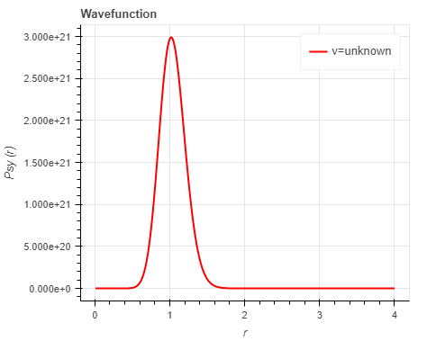
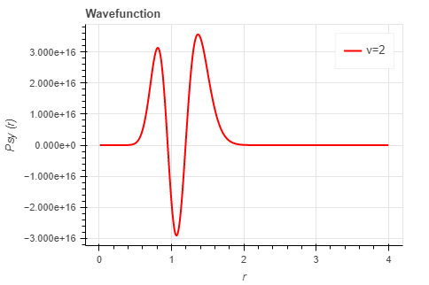
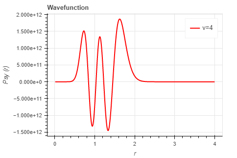
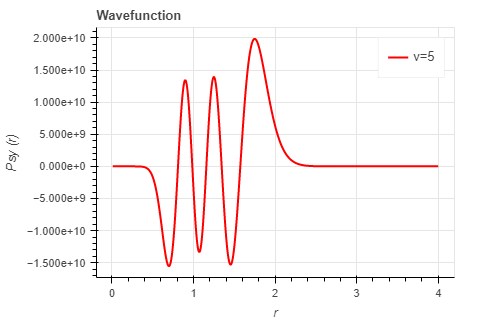
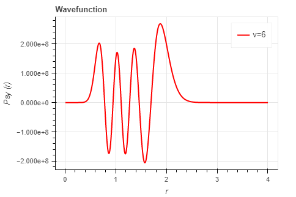
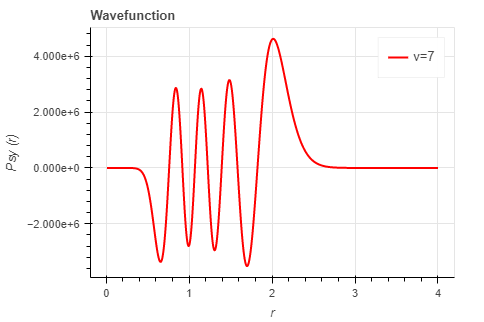
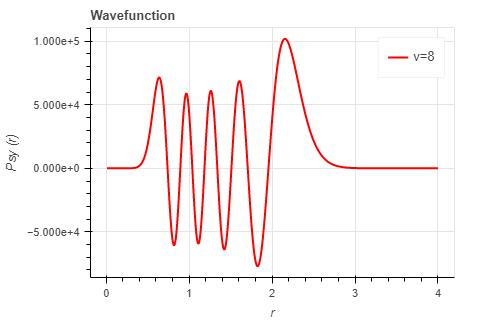

# Preparation

We know that

$$
E_1-E_0 = 4159.48 \: cm^{-1}
$$

$$
E_2-E_0 = 8083.2 \: cm^{-1}
$$

$$
B = 60.80 \: cm^{-1}
$$

We want to compute $a$, $b$ and $v_0$

$$
a = \sqrt{\frac{2(E_1-E_0)-(E_2-E_0)}{2B}} = 1.3924 \: cm^{-1}
$$

$$
b = \Bigg[\frac{(E_2-E_0)-2(E_1-E_0)}{a\big[(E_2-E_0)-3(E_1-E_0)\big]}\Bigg]^2 = 1.484 * 10^-3 \: cm^{-1}
$$

$$
v_0 = \frac{B}{b} = 40970.3504
$$

# Computation

While trying to run the program with $e <= -0.97$, I obtain wrong convergeance. With upper starting energy, I converge to good vibrational levels:

| Starting energy | Convergeance node ($v$) | Node energy |
| --- | --- | --- |
| -0.96 | 0 | -0.9473 |
| -0.89 | 1 | -0.8469 |
| -0.77 | 2 | -0.7529 |
| -0.68 | 3 | -0.6653 |
| -0.60 | 4 | -0.5836 |
| -0.53 | 5 | -0.5079 |
| -0.45 | 6 | -0.4378 |
| -0.38 | 7 | -0.3732 |
| -0.34 | 8 | -0.3317 |

| | | |
| --- | --- | --- |
|  |  |  |
|  |  |  |
|  |  ||

> **Note:**
> 
> I increased the starting energy from $0.01$, so the program converge to $v=0$ from $e=-0.96$ to $e=-0.90$
