# Preparation

We know that

$$
E_1-E_0 = 4159.48 \: cm^{-1}

$$

$$
E_2-E_0 = 8083.2 \: cm^{-1}

$$

$$
B = 60.80 \: cm^{-1}

$$

We want to compute $a$, $b$ and $v_0$

$$
a = \sqrt{\frac{2(E_1-E_0)-(E_2-E_0)}{2B}} = 1.3924 \: cm^{-1}

$$

$$
b = \Bigg[\frac{(E_2-E_0)-2(E_1-E_0)}{a\big[(E_2-E_0)-3(E_1-E_0)\big]}\Bigg]^2 = 1.484 * 10^-3 \: cm^{-1}

$$

$$
v_0 = \frac{B}{b} = 40970.3504

$$

# Computation

## 1) Determine numerically the vibrational energies and compare them to the theoretical values issued from the Morse potential.

While trying to run the program with $e <= -0.97$, I obtain wrong convergeance. With upper starting energy, I converge to good vibrational levels:

| Starting energy | Convergeance node ($v$) | Node energy |
| ----------------- | ------------------------- | ------------- |
| -0.96           | 0                       | -0.9473     |
| -0.89           | 1                       | -0.8470     |
| -0.77           | 2                       | -0.7529     |
| -0.68           | 3                       | -0.6653     |
| -0.60           | 4                       | -0.5836     |
| -0.53           | 5                       | -0.5079     |
| -0.45           | 6                       | -0.4378     |
| -0.38           | 7                       | -0.3732     |
| -0.34           | 8                       | -0.3317     |

|                    |                    |                    |
| -------------------- | -------------------- | -------------------- |
|  | 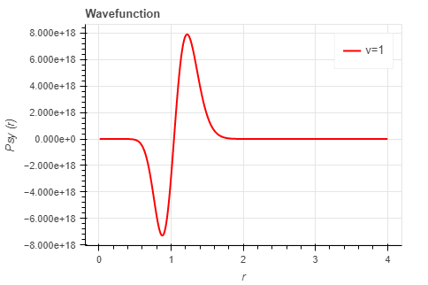 |  |
|  |  |  |
|  |  |  |

> **Note:**
>
> I increased the starting energy from $0.005$, so the program converge to $v=0$ from $e=-0.96$ to $e=-0.90$

## 2) For v = 0 and v = 1, study the variation of the number of iterations in function of the “distance” of the guess value from the finally found eigenvalue.

| Starting energy | v | v energy | Iterations |
| ----------------- | --- | ---------- | ------------ |
| -0.96           | 0 | -0.9473  | 3          |
| -0.95           | 0 | -0.9473  | 2          |
| -0.94           | 0 | -0.9473  | 3          |
| -0.92           | 0 | -0.9473  | 4          |
| -0.91           | 0 | -0.9473  | 4          |
| -0.90           | 0 | -0.9473  | 5          |
| -0.89           | 1 | -0.8469  | 9          |
| -0.88           | 1 | -0.8469  | 5          |
| -0.87           | 1 | -0.8469  | 4          |
| -0.86           | 1 | -0.8469  | 3          |
| -0.85           | 1 | -0.8469  | 2          |
| -0.84           | 1 | -0.8469  | 3          |
| -0.83           | 1 | -0.8469  | 3          |
| -0.82           | 1 | -0.8469  | 4          |
| -0.81           | 1 | -0.8469  | 4          |
| -0.80           | 1 | -0.8469  | 4          |
| -0.79           | 1 | -0.8469  | 5          |
| -0.78           | 1 | -0.8469  | 7          |

So, if I plot these data, on v=0, the evolution of the number of iteration is not obious because of the low number of points and number of iterations possible in the range where the program converge to v=0. But for v=1, we can see that the number of iteration seems to increase exponentially with the distance from the vibrational energy  indicated by the red vertical line.

| $v = 0$                          | $v = 1$                          |
| ---------------------------------- | ---------------------------------- |
| 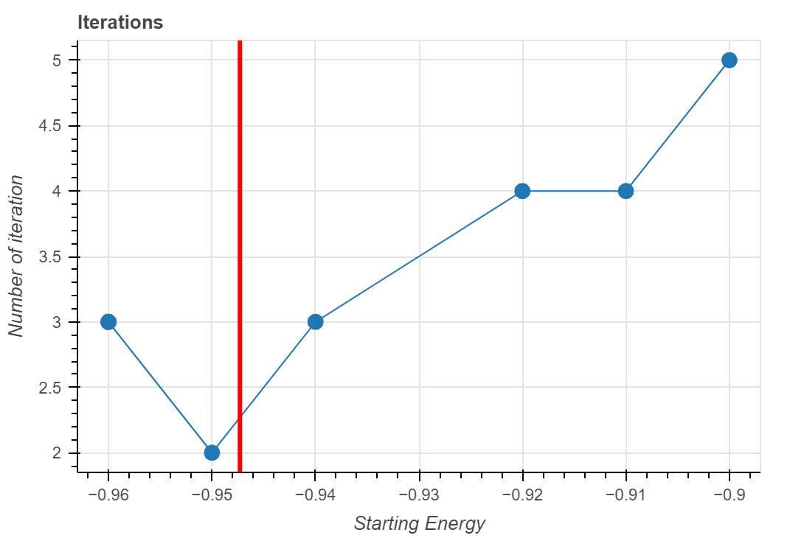 | 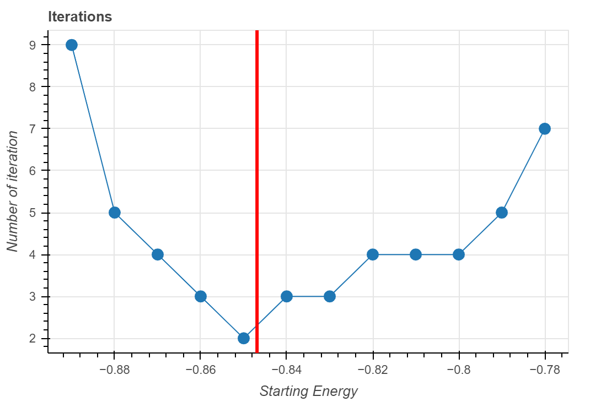 |

## 3) Study the influence of r0, rN , N, ε and τ on the number of iterations and the exactness of the result for v = 0 and for an highly excited vibrational level (at least v = 10).

I will analyse the influence of these parameters by starting from 2 differents energies:

* One near to the result like -0.85
* One "far" from the result like -0.78

### Influence of $r_0$

I expect that if $r_0$ is too high, I will have wrong results because the program don't take care of a part of the space where the wavefunction is not null.

For energy starting at -0.85

| $r_0$       | 0.1     | 0.3     | 0.5     | 0.7     | 0.9     | 1.1     | 
| ---         | ---     | ---     | ---     | ---     | ---     | ---     |
| Iterations  | 2       | 2       | 2       | 5       | 5       | 4       | 
| Ending node | 1       | 1       | 1       | 1       | 0       | 0       |
| Energy      | -0.8470 | -0.8468 | -0.8465 | -0.8393 | -0.9096 | -0.8108 |
| Plot        |  |  | 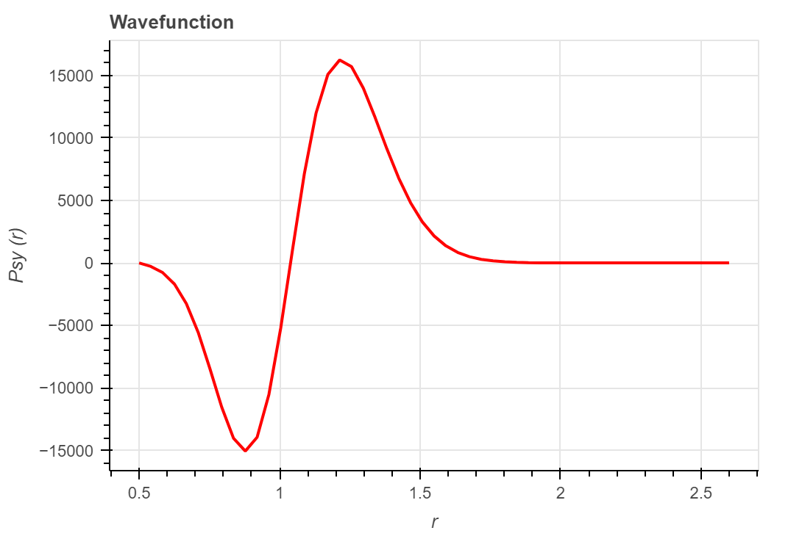 | 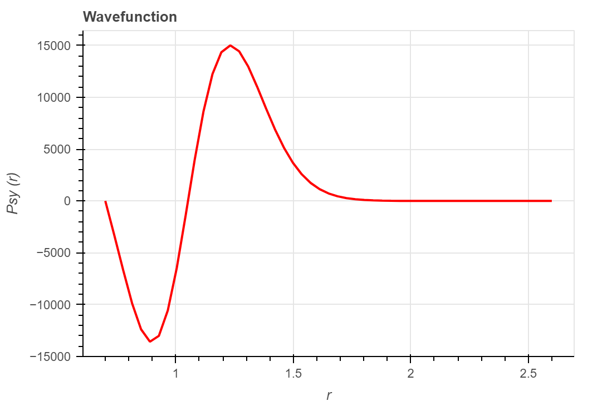 |  |  |

For energy starting at -0.78:

| $r_0$       | 0.1     | 0.3     | 0.5     | 0.7     | 0.9     | 1.1     | 
| ---         | ---     | ---     | ---     | ---     | ---     | ---     |
| Iterations  | 7       | 4       | 5       | 10      | 3       | 4       | 
| Ending node | 1       | 2       | 2       | 2       | 1       | 0       |
| Energy      | -0.8469 | -0.7524 | -0.7519 | -0.7368 | -0.7754 | -0.8108 |
| Plot        | 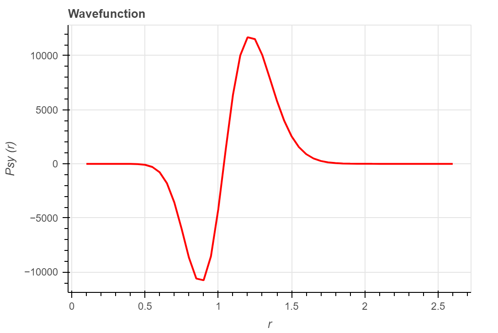 |  | 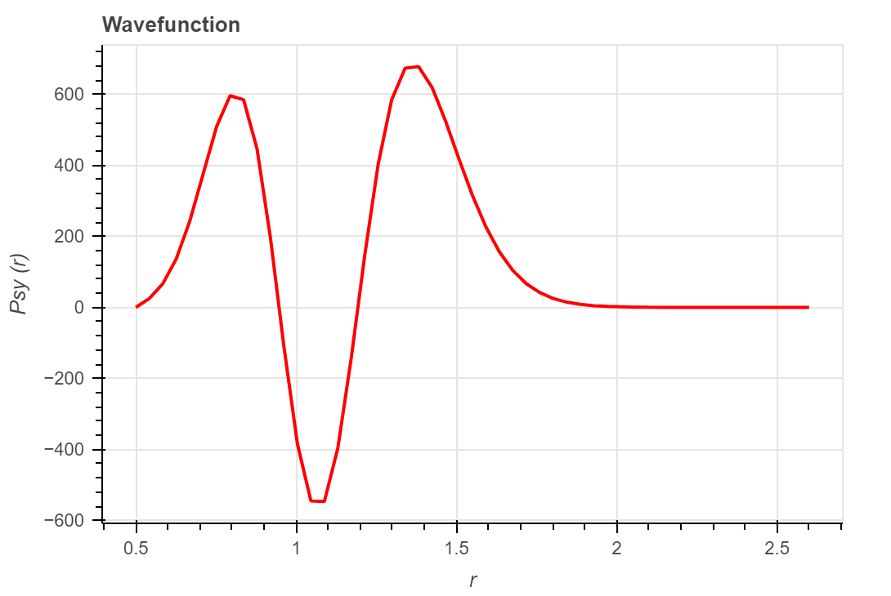 | 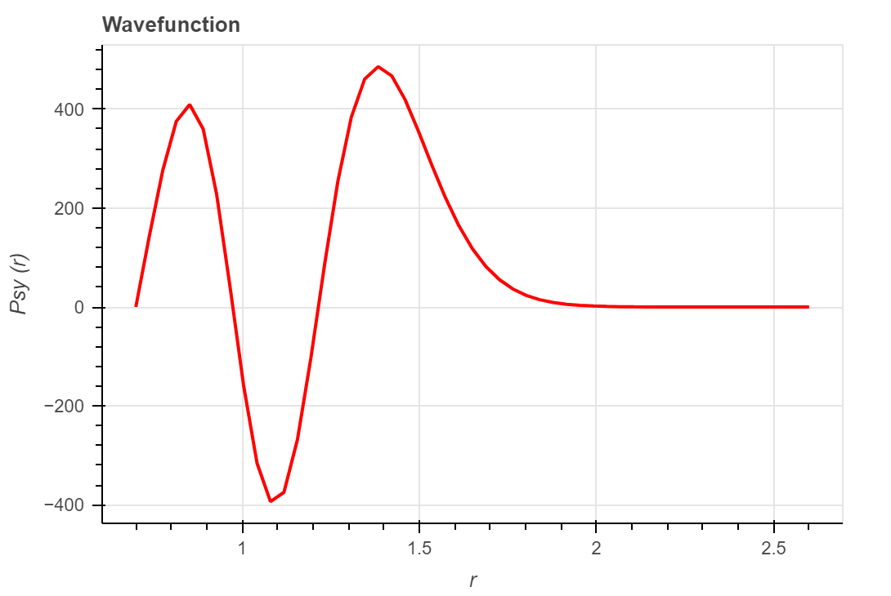 |  |  |

We can see that if we choose r0 to close to the "begining" of the wavefunction (it means that if r0 is placed where our vibrational energy is upper than the potential), the result will be at least not accurate and may be totally wrong, just giving other vibrational level with not accurate associated enery.

> **Note**
>
> Making these table take a lot of time and I see that using -0.85 as starting energy is enough conveniant to see the impact of the parameter, so I will continue only with this starting energy.

### Influence of $r_N$

I expect a similar result as for $r_0$ influence.

| $r_N$       | 2.6     | 2.3     | 2.0     | 1.7     | 1.4     | 1.1     | 
| ---         | ---     | ---     | ---     | ---     | ---     | ---     |
| Iterations  | 2       | 2       | 2       | 2       | 3       | 3       | 
| Ending node | 1       | 1       | 1       | 1       | 1       | 0       |
| Energy      | -0.8470 | -0.8466 | -0.8464 | -0.8460 | -0.9326 | -0.8856 |
| Plot        |  | 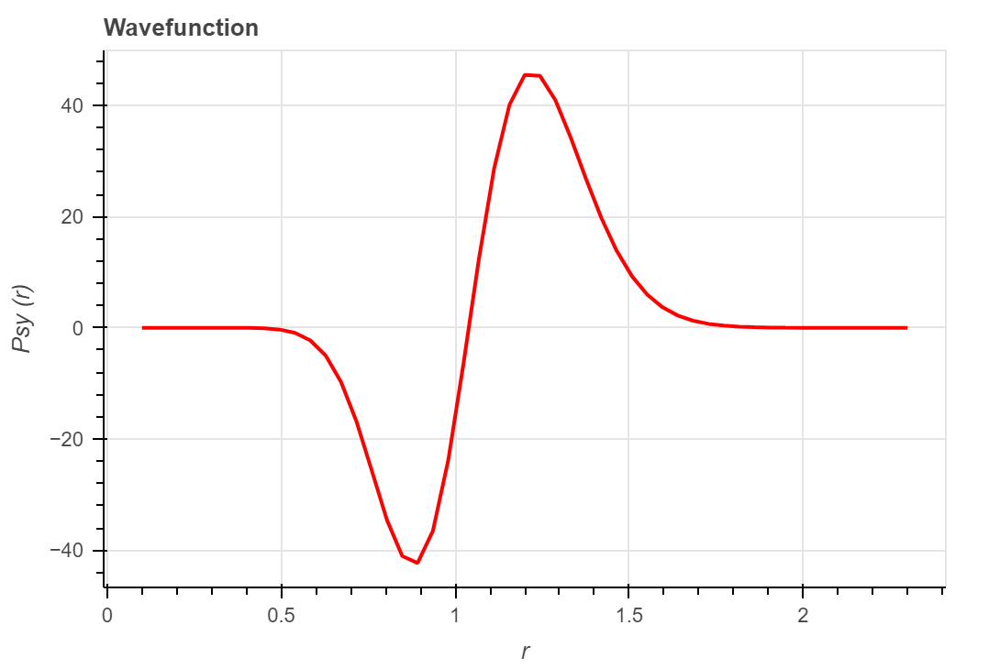 | 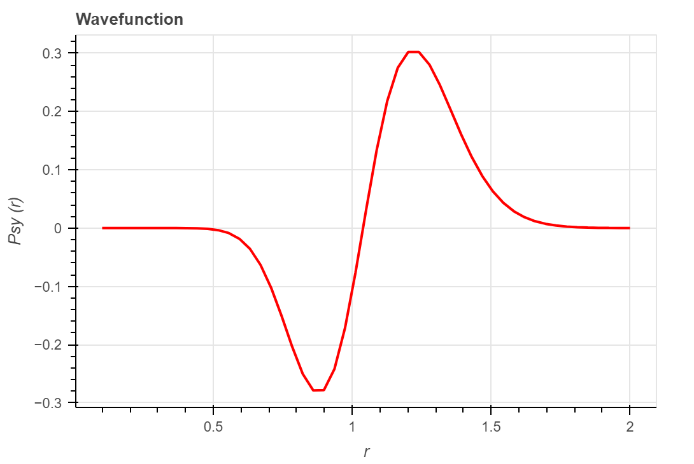 |  |  | 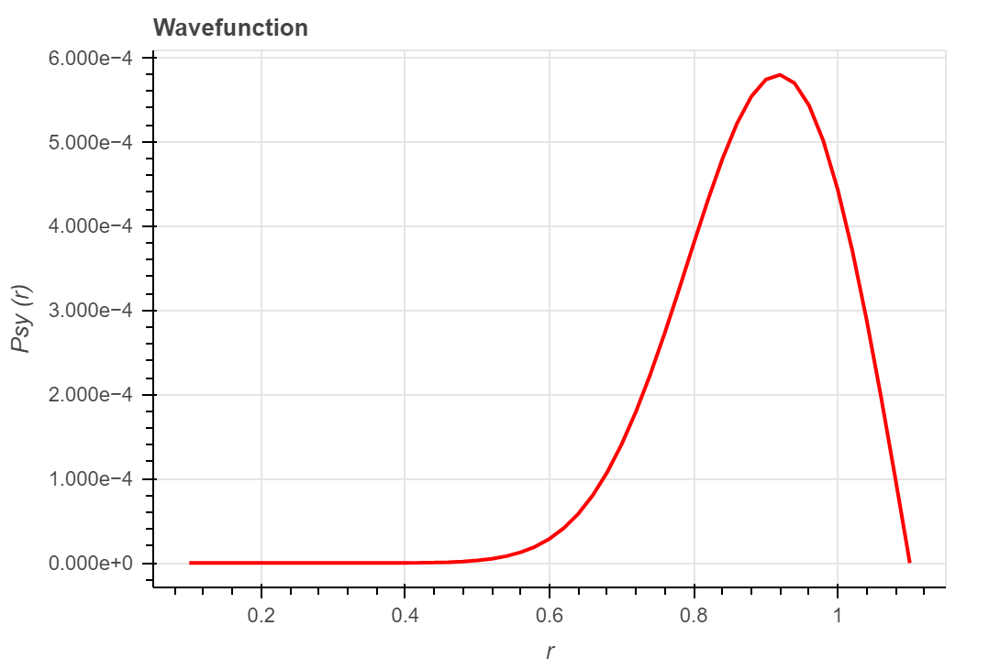 |

As I expected, we have almost the same behavior: the more we reduce $r_N$, the more we lose in precision, until a certain point where the program is not able anymore to converge to the good node.

### Influence of N

I expect that N will result in a lack of precision in determination of energy, and maybe cause problem of convergeance if the N is to low and don't allow to distinguish 2 waves.

| N           | 50      | 40      | 30      | 20      | 10      | 3       | 
| ---         | ---     | ---     | ---     | ---     | ---     | ---     |
| Iterations  | 2       | 2       | 2       | 2       | 12      | 2       | 
| Ending node | 1       | 1       | 1       | 1       | 1       | 1       |
| Energy      | -0.8470 | -0.8477 | -0.8494 | -0.8545 | -0.8891 | -0.5652 |
| Plot        |  |  |  |  |  |  |

As I expected, it has a huge influence on the precision on the obtained level energy, but I didn't expected a such impact on the number of iteration that we can see for N = 10. Also, I'm surprised to see that, even if the curve show only 1/2 "period", so like the wavefunction corresponding to v=0, it still makes the distinction and know that this is v=1

### Influence of $\epsilon$

I expect that $\epsilon$ will have a huge impact on the number of iteration and, obviously, on the precision. The less is $\epsilon$, the more will be the number of iteration.

In order to have a huge amount of iteration, I use -0.78 as starting energy

| $\epsilon$  | $10^{0}$|$10^{-2}$|$10^{-4}$|$10^{-6}$|$10^{-8}$|$10^{-10}$| 
| ---         | ---     | ---     | ---     | ---     | ---     | ---     |
| Iterations  | 7       | 7       | 7       | 7       | 7       | 7       | 
| Ending node | 1       | 1       | 1       | 1       | 1       | 1       |
| Energy      | -0.8470 | -0.8470 | -0.8470 | -0.8470 | -0.8470 | -0.8470 |
| Plot        |  |  |  |  |  |  |

The results are not at all what I expected, but it appear that I misunderstood the role of $\epsilon$. I thook it was a precision parameter, but it is actually just a value that is used to increase the wavefunction when we start to make the shooting method. So, giving that fact that we make the wave propagate from the 2 sides and we normalize it after with a coefficient that allow to perfrectly match the 2 propagations, at the end, the epsilon coefficient does not change anything. It only change the flatnesse of the wave that is drawed by the shooting methode before the normalisation. So in the end, we can see that this coefficient as no effect here.

## 4) To understand the reason, plot a graph of variation of $\delta e$ as a function of $e$ for e

Theoritically, we expect this behavior:

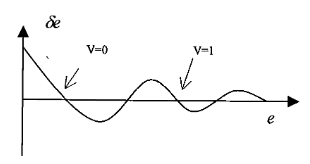

In practice, we can see this behavior:

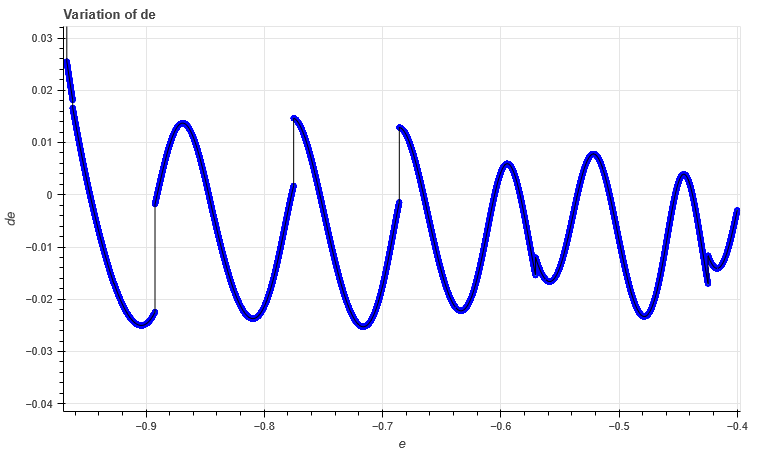

We retrieve the oscillation that are decresing in amplitude in function of $e$. However, we see that there is some jumps, corresponding to points where the convergeance node (vibrational level) change.

We can also see that ths intersection correspond to the energy of the vibrational levels. For exemple, here is the first node, that have an energy of $-0.9473$:

